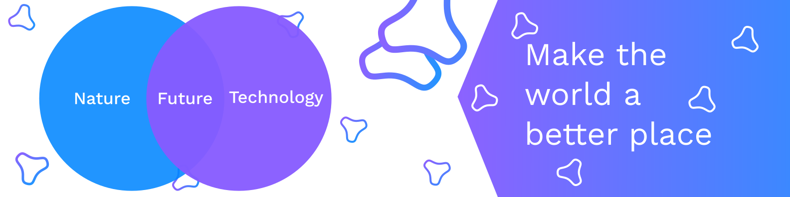

# s4g4rkumar

## *About Me :*

### Hi there 👋, I'm Sagar. I'm a compuer science engineer. Welcome to my gh page

&nbsp; &nbsp; &nbsp; &nbsp; Resume : [Sagar Kumar](tobefilledlater) (PDF download)

## 🔭 *Currently working on :*

Projects to demonstrate my knowledge. Here are some examples of what I have been working on:

- [Alarm Application](tobefilledlater)

- [Portfolio](tobefilledlater)

- [CSS Battle](tobefilledlater)

- [Games](tobefilledlater)

## 🌱 *Currently Learning :*

Automation and scripting

## 🤔 *Looking for help :*

I'm looking for help with trying to find my first software engineering job in this current job climate.

## 📫 *How to reach me :*

[Email](tobefilledlater)
 &nbsp; &nbsp; &nbsp; &nbsp; [Whatsapp](tobefilledlater)
 &nbsp; &nbsp; &nbsp; &nbsp; [LinkedIn](tobefilledlater)
 &nbsp; &nbsp; &nbsp; &nbsp; [Instagram](tobefilledlater)
 &nbsp; &nbsp; &nbsp; &nbsp; [Twitter](tobefilledlater)

## ⚡ *Fun facts :*

<!--
**s4g4rkumar/s4g4rkumar** is a ✨ _special_ ✨ repository because its `README.md` (this file) appears on your GitHub profile.
 
Here are some ideas to get you started:
 
- 🔭 I'm currently working on ...
- 🌱 I'm currently learning ...
- 👯 I'm looking to collaborate on ...
- 🤔 I'm looking for help with ...
- 💬 Ask me about ...
- 📫 How to reach me: ...
- 😄 Pronouns: ...
- ⚡ Fun fact: ...
-->
